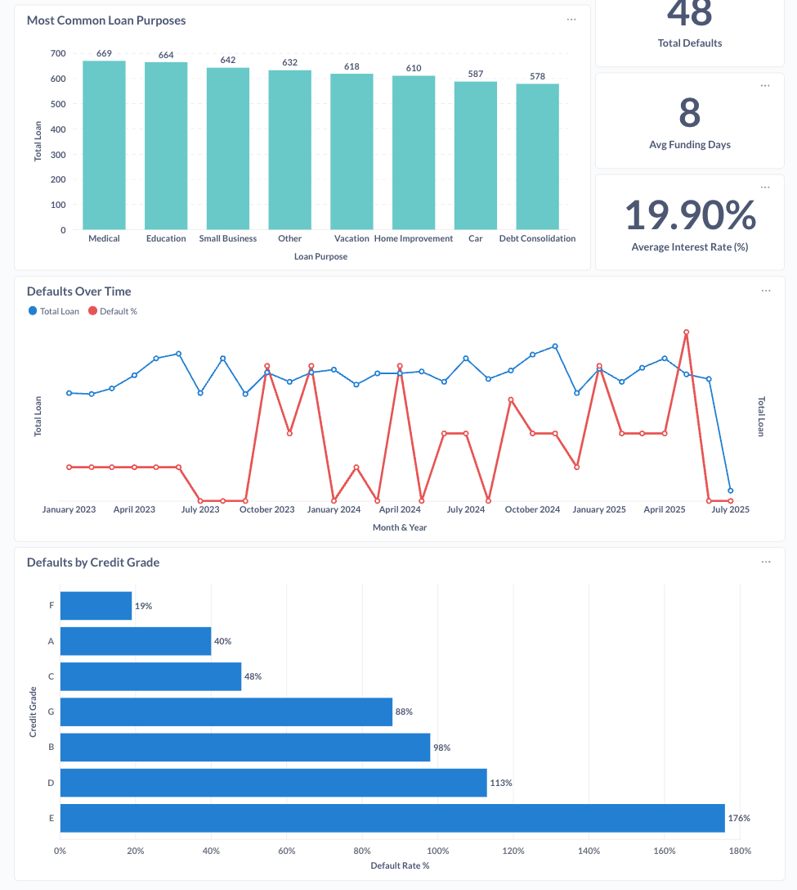

# 🏦 NZ Banking Loan & Fraud Risk — dbt Project

This is a portfolio project where I practice **SQL** and **dbt** using a dataset in the lending space.  

The raw data comes from Kaggle: [**Synthetic NZ Banking Loan and Fraud Risk Dataset**](https://www.kaggle.com/datasets/sandycandy7/synthetic-nz-banking-loan-and-fraud-risk-dataset).  

I transformed the dataset into a layered analytics warehouse with clearly defined staging, dimension, fact, and reporting models. The goal was to replicate how real-world analytics teams structure data for reliable analysis and decision-making.

 ### 🎯 Goals

- Build a dbt project starting from raw seeded data  
- Design and implement a simple star schema  
- Write clear SQL transformations to create clean, analysis-ready tables  
- Apply dbt tests and documentation to ensure quality and transparency  
- Strengthen my end-to-end data & analytics skills

### 🧱 Project Structure

- **Seed (Raw Data)**  
  The Kaggle CSV is loaded into the warehouse with `dbt seed`. This acts as the upstream input for staging.

- **Staging (`stg_`)**  
  Cleans and standardizes the seeded table:
  - Renames columns to clear, readable names  
  - Casts 0/1 flags into true/false booleans  
  - Normalizes categories (e.g. `application_type`)  
  - Converts interest rates into percentages with proper numeric casting  

- **Dimension (`dim_`)**  
  Descriptive fields you group by or filter on.  
  Example: `dim_loan_applications` holds borrower demographics, credit grade, loan purpose, and dates.

- **Fact (`fct_`)**  
  Numeric outcomes and risk metrics you aggregate.  
  Example: `fct_loan_performance` stores loan amounts, credit scores, utilization ratios, inquiries, and fraud/default flags.

- **Reporting (`rpt_`)**  
  Pre-aggregated metrics that answer business questions.  
  Example: `rpt_loan_summary` shows total loans, averages, default counts, and default rates.

### 📊 Example Metrics from `rpt_loan_summary`

- Total loans: ~5,000  
- Total loan amount: ~95M  
- Average loan amount: ~18.9K  
- Average interest rate: ~19.9%  
- Average debt-to-income ratio: ~0.18  
- Average funding days: ~7.5  
- Total defaults: 48  
- Default rate: ~0.96%  

### 📚 Documentation and Testing

- Each model has a YAML file with column-level descriptions.  
- Documentation is written in `docs.md` blocks for clear, human-readable explanations.  
- Tests include `unique` and `not_null` checks on keys like `loan_id`.  
- I used `dbt docs generate` and `dbt docs serve` to build an interactive documentation site with lineage graphs and column-level details.  

  
  

## 🔍 Analysis & Dashboard

To showcase the value of the transformed data, I built a Metabase dashboard directly on top of the dbt models.  
This dashboard provides both a high-level snapshot of the loan portfolio and deeper risk insights.

---

### 📊 Portfolio Snapshot
The top row shows key metrics at a glance:  
- **Total Loans**  
- **Total Loan Amount**  
- **Average Loan Size**  
- **Average Credit Score**  
- **Default Rate (%)**  
- **Average Funding Days**

These KPIs summarize the scale and health of the lending portfolio.

### 🧩 Portfolio Mix
- **Loans by Purpose** 
- **Loans by Region** 
- **Loans by Credit Grade** 

### ⚖️ Risk & Performance
- **Defaults by Credit Grade**  
- **Defaults Over Time vs Total Loans**
- **Average Interest Rate by Grade**

### 🚀 Operational Insights
- **Funding Speed Distribution**  
- **Top 10 Borrowers by Loan Amount**

### 📸 Dashboard 

  
  

